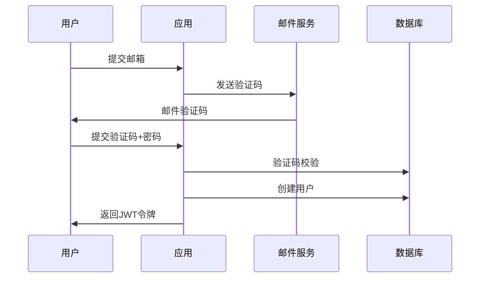
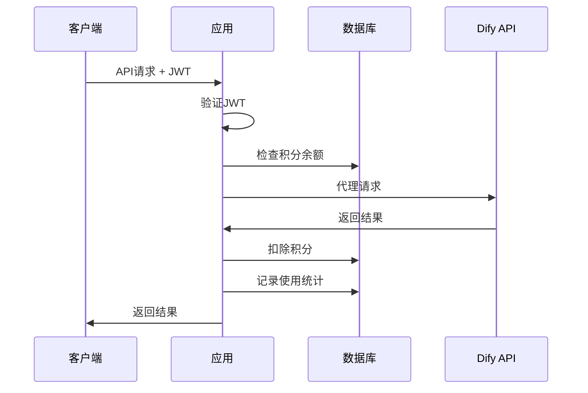

# Dify Proxy 项目开发进度报告

> 📅 **更新时间**: 2025年6月14日  
> 🏷️ **版本**: v0.0.1  
> 👥 **目标受众**: 开发团队成员  

## 📋 项目概述

**Dify Proxy** 是一个基于 NestJS 的 Dify API 代理服务，为用户提供安全、可控的 AI 服务访问。项目采用现代化的微服务架构，集成了完整的用户管理、积分系统和 API 代理功能。

### 🎯 核心价值
- 🔐 **安全代理**: 保护 Dify API 密钥，提供安全的访问控制
- 💰 **积分管理**: 灵活的积分消费模式，支持多种获取方式
- 📊 **使用统计**: 详细的 API 调用统计和成本分析
- 🛡️ **企业级**: 完整的认证、限流、监控体系

## 🚀 当前开发状态

### ✅ 已完成功能

#### 1. 核心架构 (100%)
- [x] NestJS 应用框架搭建
- [x] TypeScript 配置和类型定义
- [x] 模块化架构设计
- [x] 全局异常处理和验证管道
- [x] CORS 和安全配置

#### 2. 数据库设计 (100%)
- [x] Prisma ORM 集成
- [x] PostgreSQL 数据库配置
- [x] 完整的数据模型设计：
  - 用户表 (User)
  - 积分历史 (CreditHistory)
  - 签到记录 (CheckinRecord)
  - API 使用记录 (ApiUsageRecord)
  - 验证码表 (VerificationCode)
- [x] **自动数据库迁移系统** ⭐
  - 应用启动时自动运行迁移
  - 开发/生产环境适配
  - 完整的数据库管理脚本

#### 3. 用户认证系统 (100%)
- [x] 邮箱验证码注册/登录
- [x] JWT 令牌认证
- [x] Passport 集成
- [x] 邮件发送服务 (Resend)
- [x] 验证码生成和验证
- [x] 用户状态管理

#### 4. 积分管理系统 (100%)
- [x] 积分余额管理
- [x] 积分消费记录
- [x] 积分历史查询
- [x] 多种积分类型支持：
  - 签到奖励 (CHECKIN)
  - API 消费 (CONSUMPTION)
  - 奖励积分 (BONUS)
  - 购买充值 (PURCHASE)
  - 管理员操作 (ADMIN)

#### 5. 签到系统 (100%)
- [x] 每日签到功能
- [x] 连续签到奖励机制
- [x] 签到历史记录
- [x] 积分自动发放

#### 6. API 代理服务 (100%)
- [x] Dify API 安全代理
- [x] 请求认证和授权
- [x] Token 使用统计
- [x] 积分消费计算
- [x] 错误处理和日志记录

#### 7. 部署和运维 (100%)
- [x] Docker 容器化
- [x] Docker Compose 编排
- [x] Nginx 反向代理配置
- [x] 生产环境优化
- [x] 环境变量管理
- [x] **GitHub 代码仓库** ⭐
  - 仓库地址: https://github.com/xiejeep/dify-proxy
  - 完整的项目文档
  - 自动化部署配置

#### 8. 开发工具 (100%)
- [x] 前端测试工具
- [x] API 接口测试页面
- [x] 开发环境配置
- [x] 代码格式化和 Lint
- [x] 数据库管理脚本

### 🔧 技术栈详情

| 分类 | 技术选型 | 版本 | 状态 |
|------|----------|------|------|
| **后端框架** | NestJS | 11.0.1 | ✅ 已集成 |
| **编程语言** | TypeScript | Latest | ✅ 已配置 |
| **数据库** | PostgreSQL | 15 | ✅ 已部署 |
| **ORM** | Prisma | 6.9.0 | ✅ 已集成 |
| **缓存** | Redis | 7 | ✅ 已部署 |
| **认证** | JWT + Passport | Latest | ✅ 已实现 |
| **邮件服务** | Resend | 4.5.2 | ✅ 已集成 |
| **容器化** | Docker | Latest | ✅ 已配置 |
| **反向代理** | Nginx | Latest | ✅ 已配置 |
| **限流** | @nestjs/throttler | 6.4.0 | ✅ 已集成 |

## 📊 项目统计

### 代码规模
- **总文件数**: 68+ 个文件
- **核心模块**: 7 个主要功能模块
- **API 端点**: 15+ 个接口
- **数据模型**: 5 个核心实体

### 功能覆盖
- **用户管理**: 100% 完成
- **认证授权**: 100% 完成
- **积分系统**: 100% 完成
- **API 代理**: 100% 完成
- **数据统计**: 100% 完成
- **部署运维**: 100% 完成

## 🏗️ 架构设计

### 系统架构图
```
┌─────────────────┐    ┌─────────────────┐    ┌─────────────────┐
│   前端测试工具    │    │     Nginx       │    │   用户客户端     │
│   (HTML/JS)     │    │   (反向代理)     │    │   (移动端/Web)   │
└─────────────────┘    └─────────────────┘    └─────────────────┘
         │                       │                       │
         └───────────────────────┼───────────────────────┘
                                 │
                    ┌─────────────────┐
                    │   NestJS App    │
                    │   (主应用服务)   │
                    └─────────────────┘
                                 │
                 ┌───────────────┼───────────────┐
                 │               │               │
        ┌─────────────────┐ ┌─────────────────┐ ┌─────────────────┐
        │   PostgreSQL    │ │     Redis       │ │   Dify API      │
        │   (主数据库)     │ │   (缓存/会话)    │ │   (AI服务)      │
        └─────────────────┘ └─────────────────┘ └─────────────────┘
```

### 模块依赖关系
```
AppModule
├── AuthModule (认证模块)
│   ├── EmailModule (邮件服务)
│   └── PrismaModule (数据库)
├── UserModule (用户管理)
│   └── PrismaModule
├── CreditModule (积分管理)
│   └── PrismaModule
├── CheckinModule (签到系统)
│   ├── CreditModule
│   └── PrismaModule
├── DifyProxyModule (API代理)
│   ├── CreditModule
│   └── PrismaModule
└── EmailModule (邮件服务)
```

## 🔄 核心业务流程

### 1. 用户注册流程


### 2. API 调用流程


## 📈 性能和安全特性

### 性能优化
- ✅ **数据库连接池**: Prisma 自动管理
- ✅ **Redis 缓存**: 会话和临时数据缓存
- ✅ **请求限流**: 每分钟 100 次请求限制
- ✅ **异步处理**: 非阻塞 I/O 操作
- ✅ **容器化部署**: Docker 优化的生产环境

### 安全措施
- ✅ **JWT 认证**: 无状态令牌认证
- ✅ **密码加密**: bcrypt 哈希加密
- ✅ **CORS 配置**: 跨域请求控制
- ✅ **输入验证**: class-validator 数据验证
- ✅ **错误处理**: 统一异常过滤器
- ✅ **API 密钥保护**: 服务端代理模式

## 🚀 部署状态

### 开发环境
- ✅ **本地开发**: Docker Compose 一键启动
- ✅ **热重载**: 开发模式自动重启
- ✅ **数据库迁移**: 自动初始化和迁移
- ✅ **测试工具**: 前端测试页面可用

### 生产环境
- ✅ **容器化**: Docker 镜像构建完成
- ✅ **数据库**: PostgreSQL 生产配置
- ✅ **缓存**: Redis 持久化配置
- ✅ **反向代理**: Nginx 配置完成
- ✅ **自动迁移**: 启动时自动数据库初始化

## 📚 文档和资源

### 已完成文档
- ✅ **README.md**: 项目介绍和快速开始
- ✅ **DATABASE_SETUP.md**: 数据库设置指南
- ✅ **API 文档**: 接口说明和示例
- ✅ **部署指南**: Docker 部署说明
- ✅ **开发指南**: 本地开发环境设置

### 测试工具
- ✅ **前端测试页面**: 完整的 API 测试界面
- ✅ **Postman 集合**: API 接口测试集合
- ✅ **单元测试**: Jest 测试框架集成

## 🎯 下一步计划

### 短期目标 (1-2周)
1. **监控和日志**
   - 集成应用性能监控 (APM)
   - 结构化日志记录
   - 错误追踪和报警

2. **API 文档优化**
   - Swagger/OpenAPI 集成
   - 交互式 API 文档
   - 接口版本管理

3. **测试覆盖**
   - 单元测试补充
   - 集成测试编写
   - E2E 测试自动化

### 中期目标 (1个月)
1. **功能增强**
   - 管理员后台界面
   - 用户使用报表
   - 积分充值接口
   - 多租户支持

2. **性能优化**
   - 数据库查询优化
   - 缓存策略优化
   - 负载均衡配置

### 长期目标 (3个月)
1. **企业级特性**
   - 微服务拆分
   - 服务网格集成
   - 多区域部署
   - 灾备方案

## 👥 团队协作

### 开发流程
1. **代码仓库**: https://github.com/xiejeep/dify-proxy
2. **分支策略**: Git Flow 工作流
3. **代码审查**: Pull Request 必须审查
4. **自动化**: CI/CD 流水线 (计划中)

### 环境管理
- **开发环境**: 本地 Docker Compose
- **测试环境**: 云端测试实例 (计划中)
- **生产环境**: 云端生产集群 (计划中)

### 联系方式
- **项目负责人**: [待填写]
- **技术负责人**: [待填写]
- **问题反馈**: GitHub Issues

## 📊 项目健康度

| 指标 | 状态 | 评分 |
|------|------|------|
| **代码质量** | 优秀 | 🟢 9/10 |
| **文档完整性** | 良好 | 🟢 8/10 |
| **测试覆盖** | 待改进 | 🟡 6/10 |
| **部署就绪** | 优秀 | 🟢 9/10 |
| **安全性** | 良好 | 🟢 8/10 |
| **可维护性** | 优秀 | 🟢 9/10 |

**总体评分**: 🟢 **8.2/10** (优秀)

---

> 💡 **提示**: 本文档会定期更新，请关注 GitHub 仓库获取最新进度。
> 
> 🔗 **项目地址**: https://github.com/xiejeep/dify-proxy
> 
> 📧 **问题反馈**: 请在 GitHub Issues 中提交问题和建议。